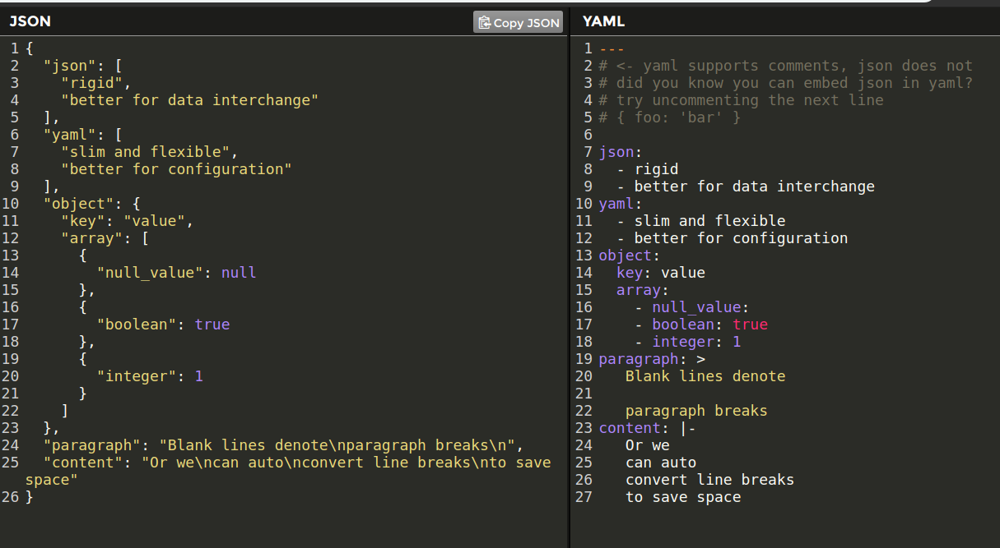

In this blog post, I will guide you through the basics of the YAML file and then we will write a sample .travis.yml file which I try to make as general as possible so that you can use Travis CI more efficiently. Also, this blog post is for those people who are familiar with the concept of CI/CD and testing.
 
<h2>What is YAML?</h2>
YAML is a [recursive acronym](https://en.wikipedia.org/wiki/Recursive_acronym) for “YAML Ain’t markup language”. Like JSON it is a data serialization language( i.e it can be used to store or transmit data across networks)

<h2>Some differences between YAML and JSON</h2>



<h2>YAML syntax</h2>
I will cover some basic syntax that will get you started but if you would like to learn more, refer this [link](https://yaml.org/refcard.html)

<h3>The basic syntax of YAML is </h3>
Key value pairs are separated using <b>":"</b>
```
key: value
```
You can comment using  <b>"#"</b>
```
# this is a comment in YAML
key: value
```

This knowledge is enough for our example. Now let us start with our .travis.yml file 

<h2>The Travis config file</h2>
Please keep a note on this as YAML files have strict rules for indentation.

<h3>The programming tool </h3>
We start configuring our .travis.yml file with the language we will be using. For example, I will be creating this Travis file for my MERN stack app so I will choose my language as nodejs for testing my backend code.
```
language: node_js
node_js:
  - "11"
```
Now here we tell the Travis CI that we want our environment to be nodejs we also specify the specific version of it. I used v11 you can use any version you want, you can test for multiple version by mentioning them below like
```
language: node_js
node_js:
  - "11"
  - "12"
```
You can also test this for the current stable version of nodejs like
```
language: node_js
node_js:
  - "stable"
```

<h3>The Build Environment</h3>
We can specify the distro/OS/Build environment we would like Travis to execute our tests in. I would recommend using trusty as this distro is lightweight and more reliable. Although this is the default distro set by Travis CI, I will show you the config so that you can use any distro you want and is offered by Travis.
```
dist: trusty
```
Other distros offered by Travis are
- Ubuntu Xenial 16.04
- Ubuntu Precise 12.04

<h3>Services</h3>
Many times we have various services interacting with our project. We need to include them to completely test our projects. One option you can choose is to integrate an online set up of the services but that would increase the time taken by the tests plus if the service is paid you will have to pay the extra cost for every request to your service. So Travis ci provides a solution for this by providing you the option to install the service you need with the build and configure it according to your needs.
There are many services we can configure but this post is not about it so 
I will show you how to configure MongoDB for CI.
```
services: mongodb
```
You have to use the key `services` for any service you want to tell Travis to install the dependencies. Now to configure it you can do it the same way you do locally eg-
```javascript
var url = "mongodb://localhost:27017/mydb";

MongoClient.connect(url, function(err, db) {
  if (err) throw err;
  console.log("Database created!");
  db.close();
});
``` 
that's it you have to connect to the port no 27017 on localhost. Just follow the same default connection instruction for the service you would like to connect. You can [look up here](https://docs.travis-ci.com/user/database-setup/) for other services.

<h3>Environment variables</h3>
You can set up the environment variables in which you would like to test your project using the `env` key eg -
```
env:
  - NODE_ENV=ci PORT=3000
```

<h3>cache</h3>
You can cache directories in your build so that you do not have to download it on every build as that would cost you time so you can specify the directories you want to cache using
```
cache:
  directories:
    - node_modules
``` 
Here I would like to cache my node_modules directory for every build so I don't have to download it on every build and when I add or delete a node_module Travis would just compare the package.json and make the necessary changes and cache it again

<h3>Scripts</h3>
There are various dependencies that you would like to be installed before or after the configuration of Travis CI. Or you may need to run various scripts before the build starts executing your tests. You can install or run them by using the keyword `before_install` to run commands before execution and `install` to install the dependencies after the Travis finishes to configure the build
eg -
```
before_install:
  - sudo apt-get install -y libxml2-dev
install:
  - npm install
```
So here before installing dependencies, I would like to add a dev library and after that, I would like to run the script to install dependencies for my project.

Also, you can run various scripts during the execution of the tests with the `script` keyword eg -
```
script:
  - npm run start 
  - npm run dev
```

So these are some advanced setup you can configure Travis with to make your life easy and use CI efficiently.

I would love to hear some more advanced setup from you guys that you use or your feedback for this blog I would appreciate it. Thanks for reading and I would love to hear if I was able to impart new knowledge in you through this blog post.


You can connect with me here at <a href="https://twitter.com/ram2510_" target="_blank">twitter  </a> or <a href="https://www.linkedin.com/in/ram2510/">LinkedIn.</a>

I live by the name of [@ram2510](https://www.google.com/search?q=ram2510) on the internet